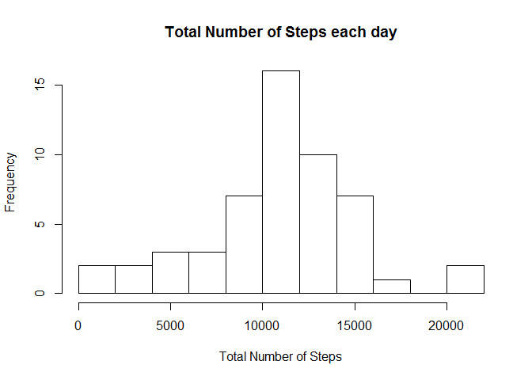
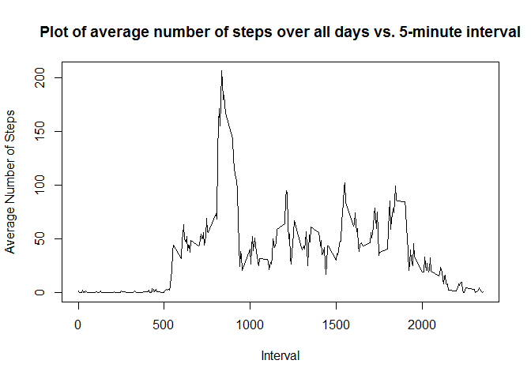
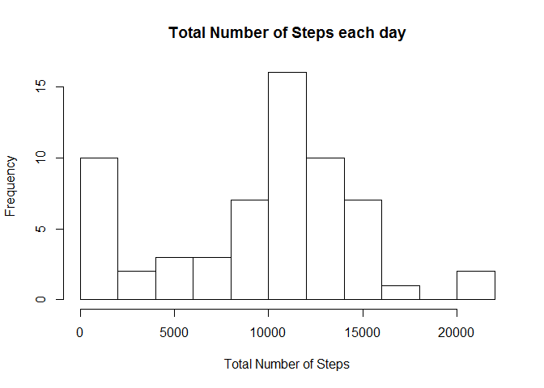
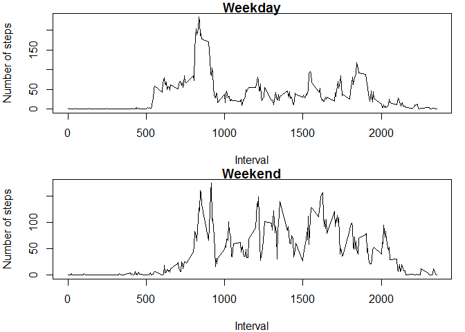

# Reproducible Research: Peer Assessment 1


## Loading and preprocessing the data


```r
library(knitr)
actData<-read.csv("activity.csv")
actDataGood <- actData[complete.cases(actData),]
sumStep<-tapply(actDataGood$steps, actDataGood$date, sum, na.rm = TRUE)
```

## What is mean total number of steps taken per day?


```r
sumStep<-tapply(actDataGood$steps, actDataGood$date, sum, na.rm = TRUE)
hist(sumStep, breaks = 10, xlab = "Total Number of Steps", main = "Total Number of Steps each day")
```

 

```r
mean2<- mean(sumStep, na.rm = T)
median2<- median(sumStep, na.rm = T)
meanStep <- tapply(actDataGood$steps, actDataGood$date, mean, na.rm = TRUE)
medianStep <- tapply(actDataGood$steps, actDataGood$date, median, na.rm = TRUE)
```
A table of the mean steps per day 1.0766189\times 10^{4} and the median is 10765.

## What is the average daily activity pattern?

```r
intStep <- tapply(actDataGood$steps, actDataGood$interval, mean, na.rm = TRUE)

plot(rownames(intStep), intStep,type = 'l', xlab = "Interval", ylab = "Average Number of Steps", main = "Plot of average number of steps over all days vs. 5-minute interval")
```

 

```r
ind<-which(intStep==max(intStep))
indMax <- dimnames(intStep)[[1]][ind]
```
The interval with the maximum number of average steps across all days is 835. 

## Imputing missing values


```r
rowNA <- nrow(actData) - nrow(actDataGood)
actData2 <- actData
meanStepData = data.frame(meanStep)
repStep <- rep(meanStepData, each = nrow(actData)/nrow(meanStepData))
actData2[is.na(actData)] <- repStep[is.na(actData)]
sumStep2 <- tapply(actData$steps, actData$date, sum, na.rm = TRUE)
hist(sumStep2, breaks = 10, xlab = "Total Number of Steps", main = "Total Number of Steps each day")
```

 

```r
mean2a <- mean(sumStep2, na.rm = T)
median2a <- median(sumStep2, na.rm = T)
```
The numer of missing values in the original data was 2304.
To fill in the missing data the average at the same date was used. The new mean number of steps taken per day is 9354.2295082 and the median is 10395. These value differ from the results of the previous section, they are lower in value.


## Are there differences in activity patterns between weekdays and weekends?


```r
days <- weekdays(as.Date(actData2$date, format = "%Y-%m-%d"))
isWknd <- days == "Saturday" | days == "Sunday"
actData2.wkdy <- factor(isWknd, labels = c("weekday", "weekend"))
actData3<- cbind(actData, actData2.wkdy)
intStepT <- with( actData3, tapply(steps, list(interval,actData2.wkdy), mean, na.rm = TRUE))
par(mfrow = c(2,1), mar = c(4,4,1,1))
plot(rownames(intStepT), intStepT[,"weekday"],'l', xlab = "Interval", ylab = "Number of steps", main = "Weekday")

plot(rownames(intStepT), intStepT[,"weekend"],'l', xlab = "Interval", ylab = "Number of steps", main = "Weekend")
```

 
